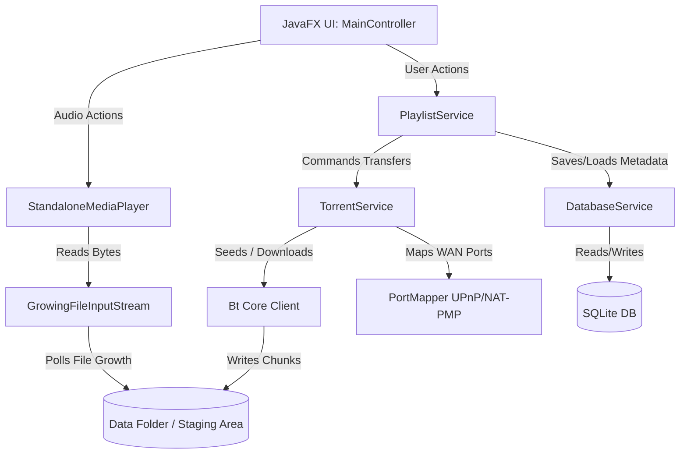
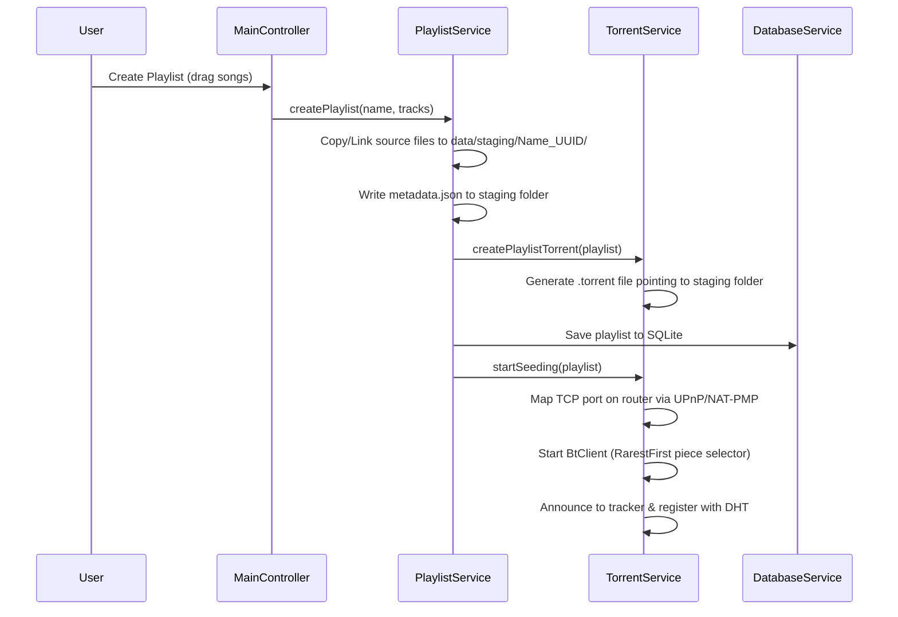
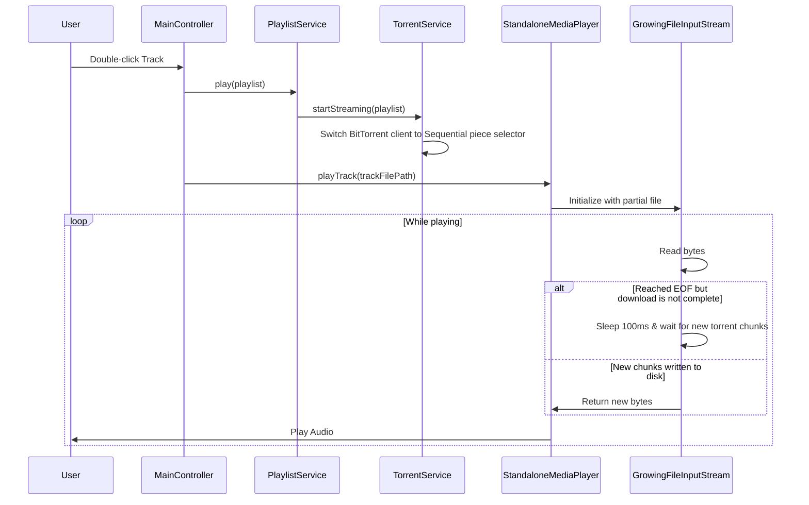

# Zemission: Architectural & Functional Map

Zemission is a peer-to-peer (P2P) music player and playlist sharing application built on JavaFX and the BitTorrent protocol. It allows users to create playlists, package them as torrents, share them over the internet, and stream audio tracks in real-time as they download from seeders.

---

## 1. High-Level Architecture

The software follows a modular design separating the User Interface (JavaFX), Core Domain logic (Playlists/Tracks), Database layer (SQLite), and the P2P networking layer (Bt client, DHT, Trackers, and UPnP Port Mapper).

---

## 2. Core Modules & Responsibilities

### 📂 Presentation Layer (UI)
*   **[Launcher](file:///home/umar/Documents/Zemission/src/main/java/com/ztype/zemmision/Launcher.java) & [Main](file:///home/umar/Documents/Zemission/src/main/java/com/ztype/zemmision/Main.java)**: Bootstraps the JavaFX environment and loads the parent view.
*   **[MainController](file:///home/umar/Documents/Zemission/src/main/java/com/ztype/zemmision/ui/MainController.java)**: 
    *   Glues UI elements (tables, sliders, sidebars) to backing services.
    *   Triggers playlist importing, exports, permanent seeding toggles, and deletion confirmations.
    *   Manages media player controls: Play, Pause, Next, Previous, and Seek Slider bindings.

### 📂 Service Layer (Business Logic)
*   **[PlaylistService](file:///home/umar/Documents/Zemission/src/main/java/com/ztype/zemmision/services/PlaylistService.java)**: 
    *   Acts as the central coordination layer.
    *   Performs file staging (copying/linking files to secure sandbox folders) and updates relative paths.
    *   Generates and merges `metadata.json` for torrent sharing.
    *   Calculates individual track download progress by matching disk size expectations against the active torrent bitfield.
*   **[TorrentService](file:///home/umar/Documents/Zemission/src/main/java/com/ztype/zemmision/services/TorrentService.java)**: 
    *   Manages the BitTorrent core engine runtime.
    *   Allocates free listener/acceptor ports dynamically (avoiding port conflicts when running multiple torrents).
    *   Leverages **DHT (Distributed Hash Table)** and **Public Trackers** for internet-wide peer lookup.
    *   Spawns the port mapper gateways (`NetworkGateway`/`ProcessGateway`) to map external TCP port rules using UPnP/NAT-PMP.
*   **[DatabaseService](file:///home/umar/Documents/Zemission/src/main/java/com/ztype/zemmision/services/DatabaseService.java)**:
    *   Manages the local SQLite database connection.
    *   Persists playlists, tracks, metadata, and custom flags (like permanent seeding).

### 📂 Utils Layer (Media & I/O)
*   **[StandaloneMediaPlayer](file:///home/umar/Documents/Zemission/src/main/java/com/ztype/zemmision/utils/StandaloneMediaPlayer.java)**:
    *   Manages the audio decoding pipeline (MP3 SPI support) and outputs PCM bytes via JavaSound `SourceDataLine`.
    *   Spawns background playback threads to avoid blocking the main UI thread.
*   **[GrowingFileInputStream](file:///home/umar/Documents/Zemission/src/main/java/com/ztype/zemmision/utils/GrowingFileInputStream.java)**:
    *   An override of `InputStream` that wraps a `RandomAccessFile`.
    *   Allows live playback of files *while* they are still downloading. If the reader hits the current EOF, it blocks (sleeping for 100ms) until more torrent chunks are written by the downloader, resuming seamlessly.

---

## 3. Core Workflows & Data Flows

### A. Playlist Creation (Seeding Mode)
When a user drags local MP3s into the app to share a new playlist:

---

### B. Track Playback & Live Streaming
When a user plays an imported playlist track that is currently downloading:

---

## 4. Key P2P & Networking Features

1.  **Distributed Discovery (Tracker + DHT)**:
    *   Announces torrent structures to `udp://tracker.opentrackr.org:1337/announce`.
    *   Mainline DHT is activated to fetch peer addresses without central tracker servers.
2.  **UPnP/NAT-PMP Port Mapping**:
    *   Integrates `com.offbynull.portmapper` to automatically detect the local gateway router.
    *   Dynamically maps the BitTorrent TCP acceptor port to the router's WAN interface, allowing incoming connections from external peers across the internet.
    *   Releases/unmaps the port rules gracefully when stopping a torrent client.
3.  **Sequential vs. RarestFirst Selection**:
    *   **Seeding Mode**: Uses **Rarest-First** chunk selection, maximizing the distribution of unique playlist blocks to the P2P swarm.
    *   **Streaming Mode**: Switches dynamically to **Sequential** selection to download the beginning of tracks first, ensuring the media player can start playback immediately without buffering delays.
